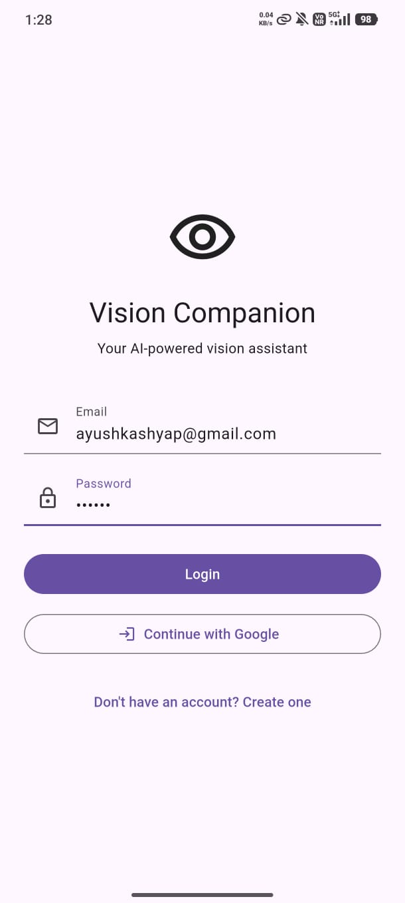
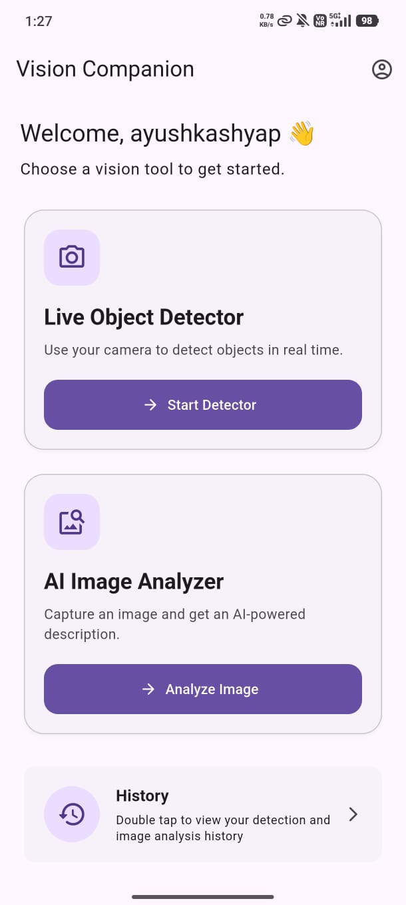
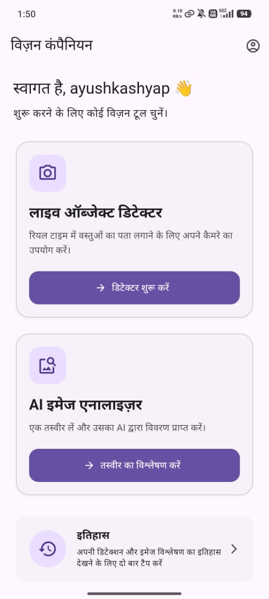
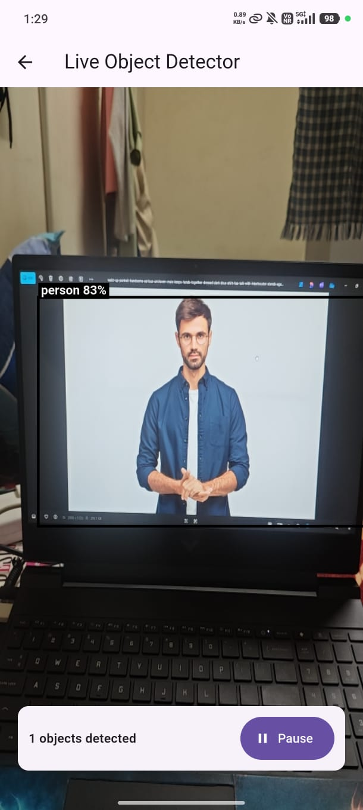
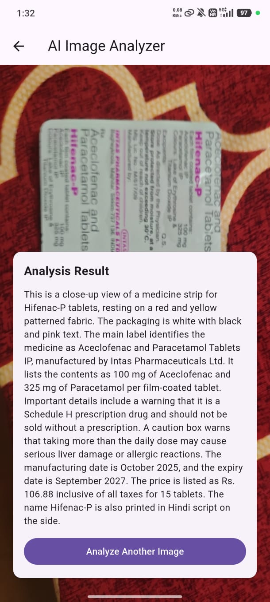
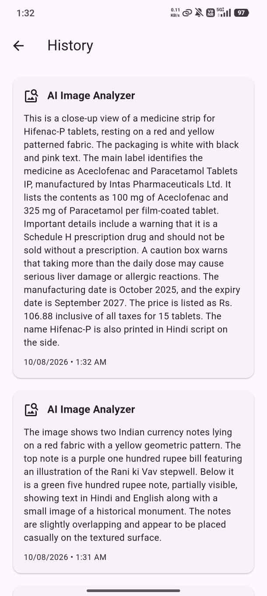
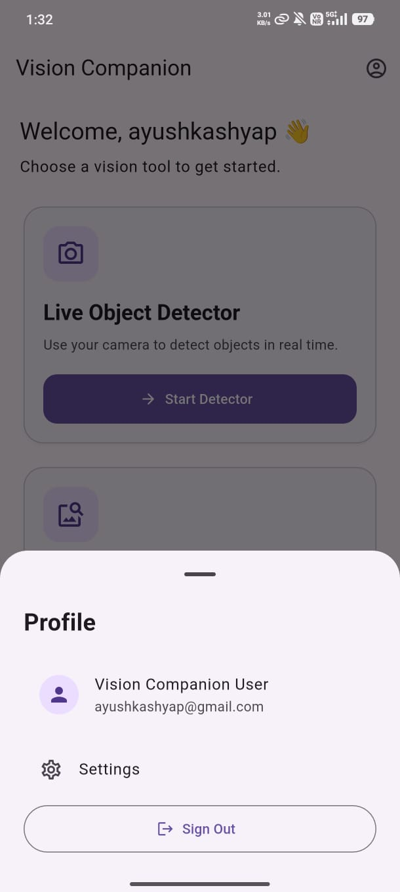
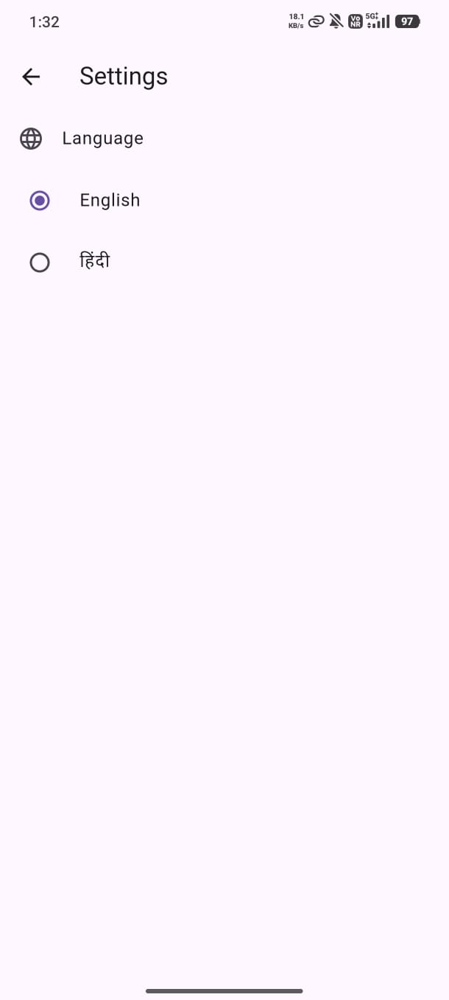

# 👁️ Vision Companion

> **An accessibility-focused AI vision assistant built with Flutter**

Vision Companion is a Flutter-based mobile application designed to assist users through **real-time object detection, AI-powered image analysis, voice feedback, haptic feedback, localization, and Android TalkBack accessibility**.

Developed as part of the **Flutter Developer Intern Assignment**.

---

## 🔗 Project Links

| Resource | Link |
|---|---|
| 📦 GitHub Repository | [Vision Companion](https://github.com/Ayush-620/vision-companion) |
| 📱 Release APK | [Download APK](https://drive.google.com/file/d/19EZu1KSt0qHA_tQZjW3AO10BLFT25m9g/view?usp=drivesdk) |

---

## ✨ Key Features

### 🔍 Live Object Detection

- Real-time camera-based object detection.
- TensorFlow Lite **SSD MobileNet V1** model.
- Bounding boxes and confidence scores.
- Voice announcements for detected objects.
- Haptic feedback.
- Pause / Resume detection.
- Detection history stored in Firestore.

### 🤖 AI Image Analyzer

- Capture images directly from the camera.
- AI-powered image descriptions using **Groq Vision API**.
- Simple descriptions suitable for spoken audio.
- Loading and error states.
- Retry and Analyze Another Image options.
- Analysis results stored in Firestore history.

### 🔐 Authentication

- Firebase Email/Password authentication.
- Google Sign-In.
- User profile information.
- Secure sign-out functionality.

### 📚 History

- Stores object detection results.
- Stores AI image analysis results.
- History is associated with the authenticated user.
- Timestamped records stored in Firestore.

### 🌐 Localization

- English and Hindi support.
- Flutter ARB-based localization.
- Language selection from Settings.
- Selected language persisted locally.

### ♿ Accessibility

- Android TalkBack support.
- Flutter `Semantics` implementation.
- Accessible buttons and controls.
- Live-region detection status.
- Accessible camera controls.
- Voice-based object detection feedback.
- Accessibility-friendly image analysis controls.

---

## 🖼️ Screenshots

| Login | Home |
|:---:|:---:|
|  |  |

| Home – Hindi | Live Object Detector |
|:---:|:---:|
|  |  |

| AI Image Analyzer | History |
|:---:|:---:|
|  |  |

| Profile | Settings |
|:---:|:---:|
|  |  |

---

## 🏗️ Architecture

Vision Companion follows a **feature-first architecture** with **Cubit-based state management**, separating UI, state management, services, repositories, and external integrations.

```text
                         Vision Companion
                                |
                +---------------+---------------+
                |                               |
          Presentation                      Core
                |                               |
        +-------+-------+               +-------+-------+
        |               |               |               |
      Cubit           Widgets         Router          DI
        |                               |
        +---------------+---------------+
                        |
                 Services / Repositories
                        |
          +-------------+-------------+
          |             |             |
     TFLite Model   Groq Vision    Firebase
          |             |             |
     Object        Image Analysis   Auth
     Detection                     Firestore
                                   Analytics
                                   Crashlytics
```

### Application Flow

```text
User
  ↓
Flutter UI
  ↓
Cubit
  ↓
Service / Repository
  ↓
TFLite / Groq / Firebase
  ↓
Cubit State
  ↓
Updated UI + Accessibility Feedback
```

---

## 🛠️ Technology Stack

| Technology | Purpose |
|---|---|
| **Flutter / Dart** | Mobile application development |
| **Flutter Bloc / Cubit** | State management |
| **GoRouter** | Navigation |
| **Firebase Auth** | Authentication |
| **Cloud Firestore** | User history |
| **Firebase Analytics** | Usage analytics |
| **Firebase Crashlytics** | Crash reporting |
| **TensorFlow Lite** | Object detection |
| **SSD MobileNet V1** | Detection model |
| **Groq Vision API** | AI image analysis |
| **Camera** | Camera access |
| **Flutter TTS** | Voice feedback |
| **Flutter Semantics** | Accessibility |
| **Shared Preferences** | Local settings persistence |
| **Flutter Dotenv** | Environment configuration |
| **GetIt** | Dependency injection |

---

## 📁 Project Structure

```text
lib/
├── core/
│   └── di/
│
├── features/
│   ├── auth/
│   ├── home/
│   ├── detector/
│   ├── analyzer/
│   ├── history/
│   └── settings/
│
├── l10n/
│   ├── app_en.arb
│   └── app_hi.arb
│
├── app.dart
├── main.dart
└── firebase_options.dart
```

---

## 🔥 Firebase Integration

Firebase is used for authentication, history, analytics, and crash reporting.

### Authentication

Enabled providers:

- Email / Password
- Google Sign-In

### Firestore

User history is stored using:

```text
users/{uid}/history/{documentId}
```

Each history record contains:

```text
timestamp
featureType
resultSummary
```

### Analytics

The application records events including:

```text
feature_opened
detection_completed
image_analyzed
```

### Crashlytics

Flutter application errors are reported to Firebase Crashlytics.

---

## 🤖 Groq Vision Configuration

The AI Image Analyzer uses the Groq Vision API.

Create a `.env` file in the project root:

```env
GROQ_API_KEY=YOUR_GROQ_API_KEY
```

The application reads the key using:

```dart
dotenv.env['GROQ_API_KEY']
```

### Security

Never commit API keys or environment files.

Recommended `.gitignore`:

```gitignore
.env
.env.*
!.env.example
```

---

## 🚀 Getting Started

### Prerequisites

- Flutter SDK
- Dart SDK
- Android Studio / Android SDK
- Firebase project
- Groq API key

### 1. Clone the Repository

```bash
git clone https://github.com/Ayush-620/vision-companion
cd vision-companion
```

### 2. Install Dependencies

```bash
flutter pub get
```

### 3. Configure Firebase

Configure:

- Firebase Authentication
- Google Sign-In
- Cloud Firestore
- Firebase Analytics
- Firebase Crashlytics

Configure the required SHA-1/SHA-256 fingerprints for Google Sign-In.

### 4. Configure Groq

Create `.env`:

```env
GROQ_API_KEY=YOUR_GROQ_API_KEY
```

### 5. Generate Localization

```bash
flutter gen-l10n
```

### 6. Analyze the Project

```bash
flutter analyze
```

### 7. Run the Application

```bash
flutter run
```

---

## 🌐 Localization

Supported languages:

- 🇬🇧 English
- 🇮🇳 Hindi

Localization files:

```text
lib/l10n/app_en.arb
lib/l10n/app_hi.arb
```

Generate localization files:

```bash
flutter gen-l10n
```

The selected language is persisted using `shared_preferences`.

---

## ♿ Accessibility / TalkBack

Vision Companion uses Flutter `Semantics` to provide Android TalkBack support.

Accessibility has been implemented for:

- Login controls
- Home feature cards
- Camera preview
- Detection status
- Pause / Resume controls
- Image capture controls
- Analysis processing state
- Analysis results
- Retry controls
- History
- Settings
- Language selection

### Enable TalkBack

```text
Android Settings
      ↓
Accessibility
      ↓
TalkBack
      ↓
Enable
```

The application was tested using TalkBack navigation and double-tap activation.

> 🔊 Object detection voice feedback is intentionally provided in **English (`en-US`)**.

---

## 🧪 Testing

The following functionality has been tested:

- [x] Email / Password Login
- [x] Google Sign-In
- [x] Home Page
- [x] Live Object Detection
- [x] Object Detection Voice Feedback
- [x] Haptic Feedback
- [x] Pause / Resume Detection
- [x] AI Image Analysis
- [x] Groq Vision API
- [x] Firestore History
- [x] Firebase Analytics
- [x] Firebase Crashlytics
- [x] English Localization
- [x] Hindi Localization
- [x] TalkBack Accessibility
- [x] Physical Android Device
- [x] Android Emulator
- [x] Release APK

---

## 📦 Release Build

Generate the release APK:

```bash
flutter build apk --release
```

APK location:

```text
build/app/outputs/flutter-apk/app-release.apk
```

A tested release APK is also available from the project links above.

---

## 🔐 Security

The following must **never** be committed to the repository:

```text
.env
API keys
Private signing keys
Service account credentials
```

Before pushing changes:

```bash
git status
git diff
```

Verify that no credentials or sensitive information are staged.

---

## 📂 Documentation & Screenshots

```text
docs/
├── screenshots/
│   ├── login.jpeg
│   ├── home.jpeg
│   ├── home-hindi.jpeg
│   ├── object-detector.jpeg
│   ├── image-analyzer.jpeg
│   ├── history.jpeg
│   ├── profile.jpeg
│   └── settings.jpeg
│
└── Vision_Companion_Submission_Documentation.pdf
```

---

## 👨‍💻 Developer

**Ayush Kashyap**

[GitHub](https://github.com/Ayush-620)

---
